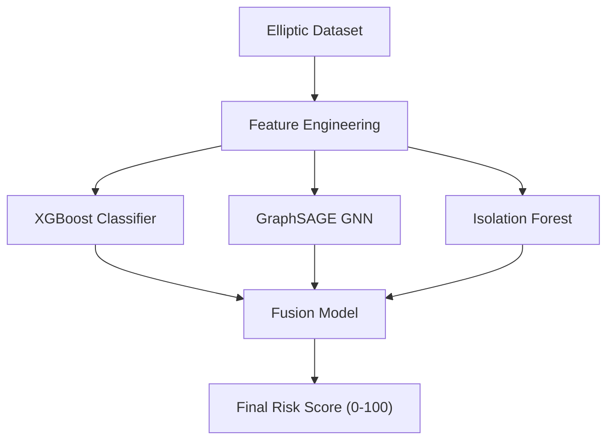

## 🛡️ ChainGuard

### Detecting Fraud in Cryptocurrency Transactions using Graph Neural Networks + XGBoost + Anomaly Detection

📌 Powered by the **Elliptic Bitcoin Transaction Graph Dataset**

---

## 🔍 Overview

Blockchain is secure — but **crypto money laundering and illicit flows** still happen.

Most fraud models analyze *only transaction features*.
❌ They ignore **network behavior** — how criminals move funds across wallets.

ChainGuard fixes that by combining **three AI fraud engines**:

| Engine              | Purpose                      | Strength                             |
| ------------------- | ---------------------------- | ------------------------------------ |
| 🧠 XGBoost          | Supervised fraud classifier  | High precision on known fraud        |
| 🕸 GraphSAGE GNN    | Graph-based risk propagation | Detects coordinated criminal wallets |
| 👁 Isolation Forest | Zero-day anomaly detection   | Finds new unseen fraud patterns      |

➡ Their outputs are **fused** into a single **Risk Score** (0–100)

---

## 🚨 What problem does ChainGuard solve?

| Industry Problem                      | ChainGuard's Answer                        |
| ------------------------------------- | ------------------------------------------ |
| Fraud spreads through wallet networks | GNN detects multi-wallet laundering        |
| Attackers change behavior             | Anomaly model catches novel crime          |
| Data privacy concerns                 | We hash + anonymize wallet IDs             |
| Compliance needs explanations         | We generate an **Intelligence PDF Report** |

---

## 🧬 Model Pipeline


### 🔥 Risk Bands

| Score | Category    | Meaning                |
| ----- | ----------- | ---------------------- |
| ≥ 80  | 🔴 Critical | Likely criminal wallet |
| ≥ 60  | 🟠 High     | Suspicious — monitor   |
| ≥ 40  | 🟡 Medium   | Possibly abnormal      |
| < 40  | 🟢 Low      | Clean wallet           |

---

## 🧩 Dataset — Elliptic Bitcoin Graph

| Attribute    | Value                          |
| ------------ | ------------------------------ |
| Transactions | 203,769                        |
| Graph Edges  | 234,355                        |
| Features     | 166                            |
| Labels       | Illicit / Legitimate / Unknown |

🔒 **Security Layer:**
✔ SHA-256 hashed wallet IDs
✔ Cannot back-trace original wallets

---

## 🖥 Platform Features

| Feature                         | Status |
| ------------------------------- | :----: |
| Transaction lookup with scoring |    ✅   |
| Money-flow graph visualization  |    ✅   |
| Bulk CSV scoring                |    ✅   |
| PDF Risk Intelligence Report    |    ✅   |
| Dark Cyber UI                   |   🎯   |

---

## 🧱 Tech Stack

| Layer            | Technology                                 |
| ---------------- | ------------------------------------------ |
| Frontend         | Next.js 15, TypeScript, Tailwind, Sigma.js |
| Backend          | FastAPI, Python                            |
| ML               | PyTorch Geometric, XGBoost, SKLearn        |
| Deployment Ready | Docker Compatible                          |

---

## 🚀 Setup & Running Locally

### 1️⃣ Backend

```bash
cd backend
conda create -n chainguard python=3.10 -y
conda activate chainguard
pip install -r requirements.txt
uvicorn main:app --reload
```

📌 API Docs → [http://127.0.0.1:8000/docs](http://127.0.0.1:8000/docs)

---

### 2️⃣ Frontend

```bash
cd frontend
npm install
npm run dev
```

📌 UI → [http://localhost:3000](http://localhost:3000)

---

## 📝 How to Use

| Goal                         | Steps                           |
| ---------------------------- | ------------------------------- |
| Check a transaction          | Search secure-ID in homepage    |
| Visualize network            | Click any row → Graph page      |
| Upload list (bulk)           | Upload CSV under **Upload** tab |
| Download intelligence report | Press 🔻 **PDF Report** button  |

📂 Example CSV:

```csv
txId
72631257
43397277
695fe1ef
```

---

## 📊 Results

| Model            | F1-Score   |
| ---------------- | ---------- |
| XGBoost          | 0.81      |
| GNN              | 0.5073       |
| **Fusion Model** | **0.8553** ⭐ |

✔ Stronger against **zero-day fraud**
✔ More resilience vs **evasion tactics**

---

## 📜 Folder Structure

```bash
ChainGuard/
│
├── backend/
│   ├── main.py
│   ├── fusion_predictor.py
│   └── utils/
│
├── frontend/
│   └── app/
│       ├── page.tsx
│       ├── tx/[id]/page.tsx
│       └── upload/page.tsx
│
└── notebooks/   # MODEL TRAINING
```

---

## 🛡 Privacy

* Wallet addresses → hashed
* No real sensitive blockchain identities stored
* GDPR-safe computation

---

## 📌 Future Enhancements

* 2-Hop Graph Propagation
* Ethereum multi-chain support
* Wallet lineage explorer (UI)
* On-chain monitoring alerts

---

## 🤝 Team

Team: **Bit Flippers**
Use for research, education & AML innovation.

---

## ⭐ Support

```text
If this project helped you…
→ ⭐ Give the repo a Star
→ 🗣 Share with blockchain researchers
```

---

## 🎤 Pitch Tagline

> **ChainGuard uncovers hidden criminal financing patterns across blockchain networks — before the damage is done.**

---

### 💡 Want the README even better?

I can optionally add:

✔ Custom logo + banner
✔ Graph images + screenshots
✔ Shields badges (version, python, stars)
✔ Live demo GIF
✔ Citation / publication section

---

Reply with **A** if you want me to:

📌 Create banner + logo & add visuals to README automatically.
